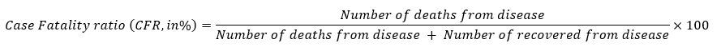

# Robert Koch Institute's German Dataset

## About Our Calculation
- We are using the dataset to calculate the CFR across genders _and_ age groups.
- Following WHO's guidelines, the CFR is calculated as follows:

    

    - CFR calculated using the above [traditional] formula during ongoing epidemics provides a conditional, estimate of CFR and is influenced by lags in report dates for cases and deaths. This leads to a wide variation in CFR estimates over the course of an epidemic, which tends toward a stable, final estimate of CFR as active cases are resolved.
    - One simple solution to mitigating the bias due to delays to case resolution during an ongoing outbreak is to restrict the analysis to resolved cases:
    - Resource: https://www.who.int/news-room/commentaries/detail/estimating-mortality-from-covid-19

## About the Dataset

**Found at:** [Declining COVID-19 Case Fatality Rates across all ages: analysis of German data](https://www.cebm.net/covid-19/declining-covid-19-case-fatality-rates-across-all-ages-analysis-of-german-data/) (9 September 2020)

**Source:** [RKI COVID19](https://npgeo-corona-npgeo-de.hub.arcgis.com/datasets/dd4580c810204019a7b8eb3e0b329dd6_0) (Updated daily)

----
_Here is the translation of their description._

Table with the current COVID-19 infections per day (time series). The table is updated daily with the current case numbers of the Robert Koch Institute.

**Data source:** Robert Koch Institute

**Terms of Use:** Robert Koch Institute; Federal Office of Cartography and Geodesy

**Credits (Attribution):** Robert Koch Institute; Federal Office of Cartography and Geodesy

The data are the "Case Numbers in Germany" of the Robert Koch Institute (RKI) and are available under the Open Data Data License Germany - Attribution - Version 2.0.

**Source reference:** Robert Koch Institute (RKI), dl-en/by-2-0

**Disclaimer:** "The content made available on the Internet pages of the Robert Koch Institute is intended solely for the general information of the public, primarily the professional public". Find out more here.

**Privacy policy:** "The use of the RKI website is generally possible without disclosing personal data". Find out more here.

Description of the data of the RKI Covid 19 Dashboard (https://corona.rki.de)

- The dashboard is based on aggregated data of the Covid-19 cases submitted by the health authorities to the RKI according to the IfSG
- With the data the daily updated status (00:00 o'clock) is represented and the changes in cases and deaths to the previous day are shown
- The data source contains the following parameters:
    - `IdBundesland` (StateId): Id of the state of the case with 1=Schleswig-Holstein to 16=Thuringia
    - `Bundesland` (State): Name of the federal state
    - `IdLandkreis` (County ID): Id of the county of the case in the usual coding 1001 to 16077=LK Altenburger Land
    - `Landkreis` (County): Name of the county
    - `Altersgruppe` (AgeGroup): age group of the case from the 6 groups 0-4, 5-14, 15-34, 35-59, 60-79, 80+ as well as unknown
    - `Altersgruppe2` (AgeGroup2): Age group of the case from 5-year groups 0-4, 5-9, 10-14, ..., 75-79, 80+ and unknown
    - `Geschlecht` (Gender): Gender of the case M=Male, W=female and unknown
    - `AnzahlFall` (NumberCases): Number of cases in the corresponding group
    - `AnzahlTodesfall` (NumberDeaths): Number of deaths in the corresponding group
    - `Meldedatum` (NotificationDate): Date when the case became known to the public health department
    - `Datenstand` (UpdateDate): Date when the data set was last updated
    - `NeuerFall` (NewCase):
        - 0: Case is included in the publication for the current day and in the publication for the previous day
        - 1: Case is only included in the current publication
        - -1: Case is only included in the publication of the previous day.

            This results in: Number of cases of the current publication as SUM(AnzahlFall), if NeuerFall in (0, 1); Delta to the previous day as SUM(AnzahlFall), if NeuerFall in (-1, 1).
    - `NeuerTodesfall` (NewDeath):
        - 0: Case is in the publication for the current day and in the publication for the previous day one death
        - 1: Case is a death in the current publication, but not in the publication of the previous day
        - -1: Case is not a death in the current publication, but was a death in the previous day's publication
        - -9: Case is neither in the current publication nor in that of the previous day a death.

            This results in: Number of deaths of the current publication as SUM(AnzahlTodesfall) if NeuerTodesfall in (0, 1); Delta to previous day as SUM(AnzahlTodesfall) if NeuerTodesfall in (-1, 1).
    - `Referenzdatum` (ReferenceDate): date of illness or, if this is not known, the notification date
    - `AnzahlGenesen` (NumberOfRecoveries): Number of recoveries in the corresponding group
    - `NewGenesen` (NewRecovery):
        - 0: Case is included in the publication for the current day and in the recovery for the previous day
        - 1: Case is a recovery in the current publication, but not in the publication of the previous day
        - -1: Case is not in the current publication, but it was in the publication of the previous day
        - -9: Case is neither in the current publication nor in that of the previous day recovered

            This results in: Number of recoveries of the current publication as SUM(AnzahlGenesen) if NewGenesen in (0, 1); Delta to previous day as SUM(AnzahlGenesen) if NewGenesen in (-1, 1).
    - `IstErkrankungsbeginn` (IsIllnesStart): 1, if the reference date is the start of the illness, 0 otherwise

In the table the country widely uniformly seized and to the Robert Koch institute (RKI) conveyed data to confirmed COVID 19 cases are represented. COVID-19 suspected cases and diseases as well as evidence of SARS-CoV-2 are reported to the responsible public health department in accordance with the German Infection Protection Act. If necessary, the health authorities determine additional information, evaluate the case and initiate the necessary infection protection measures. The data will be transmitted electronically by the public health office to the responsible state authority and from there to the RKI on the next working day at the latest. At the RKI, they are validated using largely automated algorithms.

Only cases are published in which laboratory diagnostic confirmation is available independently of the clinical picture. The data are processed at the RKI once a day at 00:00 am. The data are then available in the layer updated in the early morning hours.

The cases are assigned to the federal state or county from which the case was transmitted, which usually corresponds to the place of residence or habitual abode of the cases and not the place where the person is likely to have contracted the disease. For a regional comparison of the incidence of a disease (e.g. between districts or federal states), the incidence (number of cases per 100,000 inhabitants) should be considered instead of the absolute number of cases in order to take into account differences in population figures. The population figures used to calculate the incidence are provided by the State Statistical Offices. When presenting the new infections per day, the reporting date is used, i.e. the date on which the GA becomes aware of the case and records it electronically as such.

**Disclaimer on convalescence:**

Based on the detailed information on a case of illness provided to the RKI by the health authorities, a duration of illness is estimated for each case. In cases where only symptoms are given that indicate a mild course of the disease, a duration of 14 days is assumed. In hospitalized cases or cases with symptoms indicating a severe course of the disease (e.g. pneumonia), a duration of the disease of 28 days is assumed. Based on the onset of the disease or, if unknown, the date of notification, an estimated date of recovery is given for each case. Since in individual cases significantly longer courses of the disease are possible, or the information used here is not always transmitted to the RKI, the data calculated in this way are only rough estimates for the number of recoveries and should therefore only be used with these limitations in mind.

Translated using [DeepL](https://www.deepl.com/en/translator), reviewed by Bora <bora@boramalper.org>.
